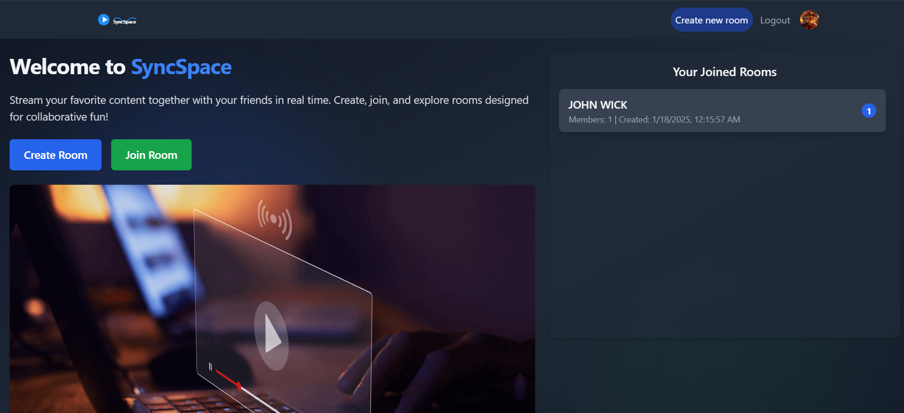
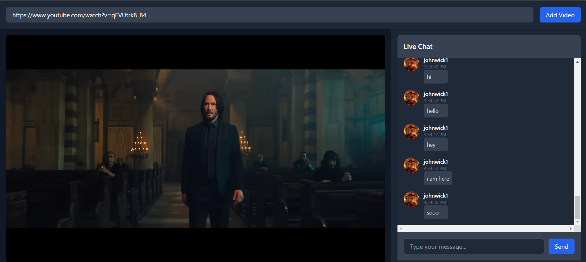

# SyncSpace Frontend  

This repository contains the React frontend for **SyncSpace**, a streaming and chatting application that allows users to watch videos together in sync and communicate in real time. 






---

## Features  

- **Video Streaming**: Watch videos with friends in sync.  
- **Real-time Chat**: Communicate seamlessly using SignalR for real-time updates.  
- **Modern UI**: A clean and responsive interface built with React and TailwindCSS.  

---

## Getting Started  

Follow these instructions to set up and run the project locally.

### Prerequisites  
- **Node.js** (v16 or above)  
- **npm** or **yarn**  

### Installation  

1. Clone the repository:  
   ```bash
   git clone https://github.com/fares7elsadek/SyncSpace-frontend.git
   cd syncspace-frontend
   ```

2. Install dependencies:  
   ```bash
   npm install
   ```  
   or  
   ```bash
   yarn install
   ```  

3. Set up environment variables:  
   Create a `.env` file in the root of the project and add the following variables:  
   ```plaintext
   REACT_APP_API_URL=<Backend API URL>
   REACT_APP_SIGNALR_URL=<SignalR Hub URL>
   ```  

### Running the Application  

Start the development server:  
```bash
npm start
```  
or  
```bash
yarn start
```  

The application will be available at `http://localhost:3000`.

---

## Project Structure  

```
src  
├── components        // Reusable UI components  
├── pages             // Main pages of the application  
├── services          // API and SignalR service integrations  
├── context           // Context providers for global state management  
├── utils             // Utility functions  
├── styles            // TailwindCSS configurations and custom styles  
```  

---

## Built With  

- **React** - Frontend framework  
- **TailwindCSS** - Utility-first CSS framework for styling  
- **React Router** - Client-side routing  
- **Axios** - HTTP client for API calls  
- **SignalR** - Real-time communication  

---

## TailwindCSS Configuration  

The project uses **TailwindCSS** for styling. Tailwind is pre-configured in the project, but you can customize it by modifying the `tailwind.config.js` file.  

### Example TailwindCSS Setup  

To extend or customize the theme, edit `tailwind.config.js`:  
```javascript
module.exports = {
  content: ['./src/**/*.{js,jsx,ts,tsx}'],
  theme: {
    extend: {
      colors: {
        primary: '#1DA1F2',
        secondary: '#14171A',
      },
    },
  },
  plugins: [],
};
```

---

## Contributing  

Contributions are welcome!  

1. Fork the repository  
2. Create your feature branch: `git checkout -b feature-name`  
3. Commit your changes: `git commit -m "Add some feature"`  
4. Push to the branch: `git push origin feature-name`  
5. Open a pull request  

---

## License  

This project is licensed under the MIT License. See the [LICENSE](LICENSE) file for details.

---

## Acknowledgments  

Special thanks to **Abdullah Yosry** for his amazing work on the frontend development of this project.  

---

Let me know if you'd like any other additions or customizations!